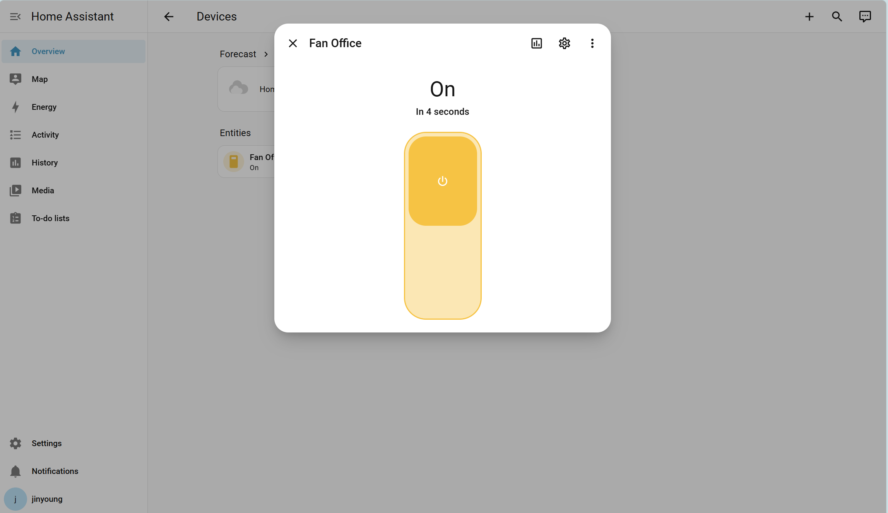

# 🏠 Raspberry Pi 5 & Home Assistant GPIO Control (HW5)

라즈베리 파이 4에 Home Assistant(HA)를 설치하고, Docker 환경에서 GPIO를 제어하여 스마트 홈 시스템을 구축한 프로젝트입니다.



## 🛠️ 개발 환경
- **Hardware**: Raspberry Pi 4
- **OS**: Raspberry Pi OS (64-bit)
- **Platform**: Home Assistant Core (Docker Container)
- **Integration**: `rpi_gpio` (Custom Component)

---
 실행 영상
https://youtube.com/shorts/8EMWgGG7DFY?feature=share

https://github.com/user-attachments/assets/62d44536-d774-40ea-b8c4-9a91d2416cdc
---

## 🔌 Hardware Setup (Wiring)
LED 및 외부 기기 제어를 위해 다음과 같이 GPIO 핀을 연결하였습니다.

| Component | BCM Pin | Physical Pin | Description |
|-----------|---------|--------------|-------------|
| **LED 1** | GPIO 11 | Pin 23       | Fan Office  |
| **LED 2** | GPIO 12 | Pin 32       | Light Desk  |

> **Note:** 모든 출력 핀에는 LED 보호를 위해 220Ω 저항을 직렬로 연결하였습니다.

---

## ⚙️ Configuration
Home Assistant의 `configuration.yaml` 파일에 추가한 스위치 제어 코드입니다.

```
yaml
# configuration.yaml
switch:
  - platform: rpi_gpio
    ports:
      11: Fan Office
      12: Light Desk
```


## 🐳 Docker 실행 명령어 (Deployment)

하드웨어(GPIO) 접근 권한 및 설정 보존을 위해 아래 명령어로 컨테이너를 구동하였습니다.

```bash
docker run -d \\
  --name homeassistant \\
  --privileged \\
  --restart=unless-stopped \\
  -e TZ=Asia/Seoul \\
  -v ~/homeassistant/config:/config \\
  --network=host \\
  ghcr.io/home-assistant/home-assistant:stable
---
```


